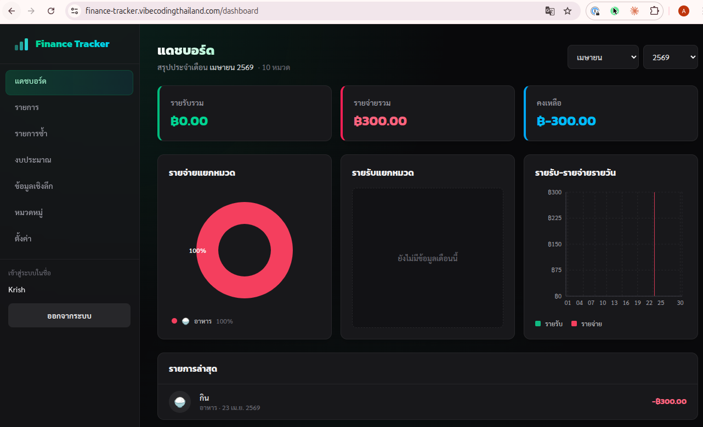
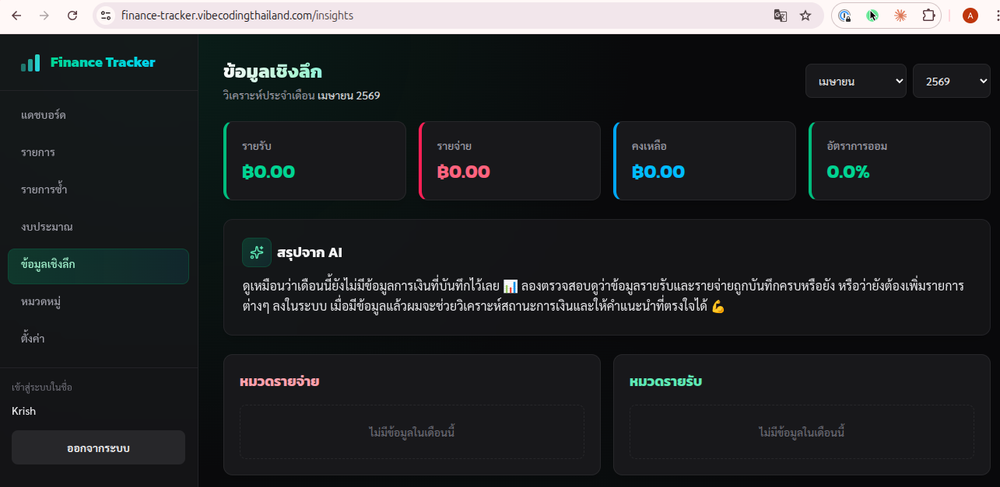
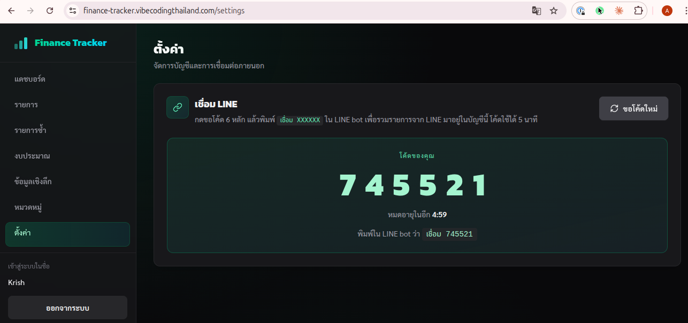

# Finance Tracker — Personal Finance App บันทึกรายจ่ายผ่าน LINE Bot + AI Insights

**โปรเจกต์ tutorial จากหนังสือ [Vibecoding with Claude Code: The Developer's Playbook](https://vibecodingthailand.com/books/vibecoding-with-claude-code/)** — เรียนรู้การใช้ **Claude Code** สร้างแอปจริงตั้งแต่ zero ถึง production บน VPS พร้อม AI integration

Personal finance tracker ฉบับคนไทย ใช้ monorepo stack **NestJS 11 + React 19 + Prisma 7 + PostgreSQL 16** user พิมพ์ข้อความค่าใช้จ่ายเข้า LINE bot → Claude จัดหมวดอัตโนมัติ → ดู dashboard + budget + monthly AI insights บน web app ทั้งหมดนี้สร้างตามขั้นตอนในหนังสือ **7 บท** (บทที่ 3–9)



---

## หนังสือต้นฉบับ

> ### Vibecoding with Claude Code: The Developer's Playbook
>
> **ฉบับภาษาไทย** | โดย **VCT Agents** | **10 บท**
>
> หนังสือสอน developer ใช้ **Claude Code** (AI coding assistant ของ Anthropic) สร้างแอปจริงตั้งแต่วาง monorepo, ออกแบบ architecture, เขียนเทส, ไปจนถึง deploy production บน VPS — repo นี้คือ codebase ที่หนังสือพาทำตามตลอดทั้งเล่ม
>
> **→ [อ่านหนังสือเลย](https://vibecodingthailand.com/books/vibecoding-with-claude-code/)**
>
> สนใจเรียน **Vibe Coding** ภาษาไทยเพิ่ม → [vibecodingthailand.com](https://vibecodingthailand.com)

---

## ฟีเจอร์ (Features)

- **บันทึกผ่าน LINE Bot** — พิมพ์ข้อความภาษาไทยเช่น `"ข้าว 80"` หรือ `"เงินเดือน 50000"` → bot ตอบกลับทันที + Claude Haiku จัดหมวดอัตโนมัติ
- **Web Dashboard** — สรุปรายรับ / รายจ่าย / คงเหลือรายเดือน, pie chart แบ่งตามหมวด, bar chart trend 6 เดือน
- **Transaction CRUD** — filter + pagination + modal edit, CSV export
- **Categories** — สร้างหมวดเองได้ + emoji picker + ownership guard (หมวด default shared vs. หมวดของ user)
- **Budget Tracker** — ตั้งงบรายเดือนต่อหมวด + progress bar เตือนเกินงบ
- **Recurring Transactions** — รายการประจำ auto-create ทุกวันตาม `dayOfMonth` (cron 00:01)
- **AI Monthly Insights** — Claude วิเคราะห์พฤติกรรมการเงินเป็นภาษาไทย + push เข้า LINE ทุกสิ้นเดือน + ดูย้อนหลังได้ที่หน้า Insights
- **LINE ↔ Web Account Linking** — 6-digit code pairing
- **Premium Dark Theme** — mesh gradient background, emerald/cyan accents, Kanit + Sarabun fonts

---

## ตัวอย่างหน้าจอ (Screenshots)

### บันทึกผ่าน LINE Bot — พิมพ์สั้น ๆ Claude จัดหมวดให้อัตโนมัติ

<table>
  <tr>
    <td width="45%"></td>
    <td width="55%" valign="middle">
      <ul>
        <li><code>"กาแฟ 65"</code> → <i>บันทึกแล้ว: กาแฟ 65.00 บาท <b>(อาหาร)</b></i></li>
        <li><code>"ค่าแทกซี่ 120"</code> → <i>บันทึกแล้ว: ค่าแทกซี่ 120.00 บาท <b>(เดินทาง)</b></i></li>
        <li><code>"เงินเดือน 45000"</code> → <i>บันทึกรายรับแล้ว: 45,000.00 บาท <b>(เงินเดือน)</b></i></li>
      </ul>
      <p>Thai parser แยกชื่อรายการ + จำนวนเงิน, <b>Claude Haiku</b> เลือกหมวดที่เข้ากับข้อความ, แยก income vs. expense จาก keyword อัตโนมัติ ไม่ต้องเปิด app บันทึกเอง</p>
    </td>
  </tr>
</table>

### หน้าเว็บ (Web Dashboard)

<table>
  <tr>
    <td width="33%" align="center"><b>แดชบอร์ด</b><br/><sub>สรุปเงินรายเดือน + charts</sub></td>
    <td width="33%" align="center"><b>ข้อมูลเชิงลึก (AI)</b><br/><sub>Claude วิเคราะห์การเงิน</sub></td>
    <td width="33%" align="center"><b>เชื่อม LINE</b><br/><sub>6-digit code pairing</sub></td>
  </tr>
  <tr>
    <td></td>
    <td></td>
    <td></td>
  </tr>
</table>

> Dark theme ทั้งหมด — mesh radial gradient บน `body` + glass morphism cards + Kanit heading / Sarabun body (Google Fonts)

---

## Tech Stack

### Frontend — `apps/frontend`

| | |
|---|---|
| Framework | React 19 + Vite 8 |
| Styling | Tailwind CSS v4 (utility-first, no custom CSS files) |
| Routing | React Router 7 |
| Charts | Recharts 3 |
| Icons | Lucide React |
| Validation | `class-validator` (reuse DTO จาก backend ใน browser) |

### Backend — `apps/backend`

| | |
|---|---|
| Framework | NestJS 11 (Module → Controller → Service → Repository) |
| ORM | Prisma 7 + PostgreSQL 16 |
| Auth | JWT + Passport strategy |
| Cron | `@nestjs/schedule` (recurring tx + monthly insights) |
| Security | `helmet` + `@nestjs/throttler` |
| Validation | `class-validator` DTO from `packages/shared` |

### AI & Integrations

| | |
|---|---|
| AI SDK | `@anthropic-ai/sdk` — Claude Haiku (categorizer) + Claude Sonnet (insights) |
| LINE | `@line/bot-sdk` — webhook signature verify + reply message |

### Infrastructure

| | |
|---|---|
| Container | Docker Compose (postgres + backend + frontend + nginx + migrator) |
| Proxy | Cloudflare Tunnel (ไม่ต้องเปิด port บน VPS) |
| VPS | Ubuntu 24.04 LTS |
| Monorepo | pnpm workspace |

---

## โครงสร้าง Monorepo

```
finance-tracker/
├── apps/
│   ├── backend/              # NestJS API (prefix /api)
│   │   └── src/
│   │       ├── auth/         # JWT register/login/me
│   │       ├── transactions/ # CRUD + monthly summary + CSV
│   │       ├── categories/   # CRUD + ownership guards
│   │       ├── budget/       # Per-category monthly budget
│   │       ├── recurring/    # Cron-based auto transactions
│   │       ├── line/         # Webhook + Thai parser + AI categorizer
│   │       ├── link/         # LINE account pairing
│   │       └── insight/      # AI monthly summary (Claude)
│   └── frontend/             # Vite + React + Tailwind
│       └── src/
│           ├── pages/        # Dashboard, Transactions, Categories, Budget, Insights
│           └── components/ui # Reusable primitives (Logo, Card, Modal, ...)
├── packages/
│   ├── database/             # Prisma schema (single source of truth)
│   └── shared/               # DTO + response interfaces (cross-wire)
├── scripts/                  # Production deploy pipeline
│   ├── server-setup.sh       # Ubuntu 24.04 bootstrap (docker + cloudflared + ufw)
│   ├── setup-tunnel.sh       # Cloudflare Tunnel installer
│   ├── deploy.sh             # Local → VPS deploy (docker save | ssh | load)
│   └── backup-db.sh          # Daily pg_dump + gzip + 30-day retention
├── nginx.conf                # Reverse proxy (frontend + backend)
├── docker-compose.yml        # Production stack
└── CLAUDE.md                 # AI assistant instructions (architecture rules)
```

---

## Quick Start

### Prerequisites

- **Node.js** ≥ 20
- **pnpm** 10.12+
- **PostgreSQL** 16 (หรือรัน `docker compose up -d postgres`)

### Setup

```bash
git clone <repo-url> finance-tracker
cd finance-tracker
pnpm install

cp .env.example .env
# แก้ค่าใน .env:
#   DATABASE_URL, JWT_SECRET
#   LINE_CHANNEL_SECRET, LINE_CHANNEL_ACCESS_TOKEN
#   ANTHROPIC_API_KEY

pnpm prisma:migrate
pnpm --filter @finance-tracker/database prisma:seed
```

### Development

```bash
# Terminal 1
pnpm dev:backend   # → http://localhost:3000/api

# Terminal 2
pnpm dev:frontend  # → http://localhost:5173
```

### Testing

```bash
pnpm --filter @finance-tracker/backend test
```

---

## เส้นทางการเรียน (Book Chapter Map)

repo นี้สะท้อน **บทที่ 3–9** ของหนังสือตรง ๆ ดู `git log` จะเห็น commit เรียงตามลำดับที่หนังสือพาทำ — แต่ละบทคือ learning milestone ที่ build ต่อจากบทก่อน:

| บท | หัวข้อ | สิ่งที่สร้าง |
|---|---|---|
| **3** | วางโครงโปรเจกต์ | pnpm monorepo skeleton, Prisma schema (User / Transaction / Category), React sidebar layout, `/api/health` endpoint |
| **4** | สอน Claude รู้จัก codebase | `CLAUDE.md` ทั้ง root / frontend / backend — architecture rules, conventions, design system (Claude อ่าน rules ก่อนทุกครั้งที่แก้) |
| **5** | MVP ครบชุด | Auth + JWT, Categories CRUD, Transactions CRUD, Dashboard พร้อม charts, Dark theme + mesh gradient + logo |
| **6** | ฟีเจอร์ขั้นสูง | Recurring transactions (daily cron), Budget tracker (per-category), CSV export |
| **7** | LINE integration | Webhook + signature verification, Thai message parser (`"ข้าว 80"` → `Transaction`), Claude auto-categorizer, link LINE ↔ web account |
| **8** | AI Insights | Monthly data aggregation, Claude-powered Thai summary, LINE cron push เดือนละครั้ง, `/insights` page ดูย้อนหลัง |
| **9** | Production Deploy | Docker Compose, Ubuntu bootstrap script, Cloudflare Tunnel, `docker save` → VPS deploy, daily PostgreSQL backup |

อยากเข้าใจ **"ทำไมถึงเลือกวิธีนี้"** ในแต่ละ decision → [อ่านหนังสือฉบับเต็ม](https://vibecodingthailand.com/books/vibecoding-with-claude-code/)

---

## Production Deployment

deployment pipeline ทั้งหมดอยู่ใน `scripts/` รันตามลำดับ — script ทุกตัวเป็น **idempotent** รันซ้ำได้โดยไม่พัง

```bash
# 1. Bootstrap VPS (Ubuntu 24.04 fresh install) — บนเซิร์ฟเวอร์
sudo bash scripts/server-setup.sh

# 2. ตั้ง Cloudflare Tunnel — บนเซิร์ฟเวอร์
#    prereq: cloudflared tunnel login && cloudflared tunnel create finance-tracker
sudo bash scripts/setup-tunnel.sh <TUNNEL_ID> <DOMAIN>

# 3. Deploy stack — จาก local machine
SERVER_IP=1.2.3.4 \
DOMAIN=finance.example.com \
REMOTE_PATH=/opt/finance-tracker \
bash scripts/deploy.sh

# 4. (บน server) ตั้ง cron backup รายวัน 03:00
echo '0 3 * * * /opt/finance-tracker/scripts/backup-db.sh' | sudo tee /etc/cron.d/finance-backup
```

รายละเอียดแต่ละ step + troubleshooting → **บทที่ 9** ของหนังสือ

---

## Architecture Highlights

- **Monorepo with shared DTO** — `packages/shared` เก็บ DTO class + response interface ที่ frontend กับ backend import ร่วมกัน → contract เดียว เปลี่ยน field ที่เดียว compile error ทุกฝั่ง
- **Repository pattern** — Service ห้ามเรียก Prisma client ตรง ๆ ต้องผ่าน Repository → mock ง่ายใน unit test
- **Claude-readable codebase** — `CLAUDE.md` + `.claude/rules/*.md` บอก AI assistant ว่าโปรเจกต์มี convention อะไร → แก้โค้ดตาม style ถูกต้องแต่แรก
- **Defense in depth** — JWT guard + LINE signature guard + throttler + helmet + input validation via DTO + Prisma prepared statements
- **Production-grade secrets** — `.env.production` ไม่ commit, Prisma ใช้ `env()` config, LINE signature verify บน raw body

---

## License

MIT — เอาไปเรียน ไปปรับ ไปใช้ต่อได้เลย

---

## อ่านเพิ่ม / ติดตาม

**สั่งซื้อ / อ่านหนังสือฉบับเต็ม**
→ [**Vibecoding with Claude Code: The Developer's Playbook**](https://vibecodingthailand.com/books/vibecoding-with-claude-code/)

**คอร์ส + ชุมชน + บทความ Vibe Coding ภาษาไทย**
→ [vibecodingthailand.com](https://vibecodingthailand.com)

**หนังสือเล่มอื่นจาก Vibe Coding Thailand**
→ [Claude Cowork: The Business Playbook](https://vibecodingthailand.com/books/) — สำหรับคนทำธุรกิจที่อยากใช้ Claude

---

*Built with Claude Code. Published by Vibe Coding Thailand.*
